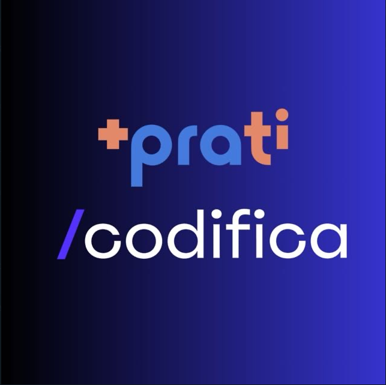

Este repositório conterá os exercícios que serão realizados ou que já foram realizados do curso FullStack da +PraTi em parceria com a Codifica Edu.

A ordem dos exercícios segue a seguinte estrutura:

- lista-de-exercícios-1 - [clique aqui e confira](https://github.com/leofrs/maisPraTi/tree/main/lista-de-exerc%C3%ADcios-1)
  - Aqui contém todas as questões da primeira lista de exercícios, sendo ela composta por 15 questões. Essas questões involvem funções básicas, loops, entrada de input (através da biblioteca prompt sync), condicionais e operações de swap/troca,
